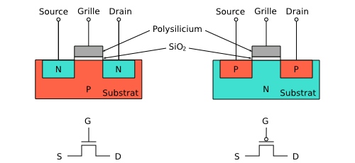
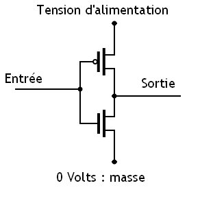
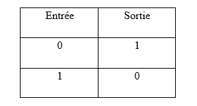
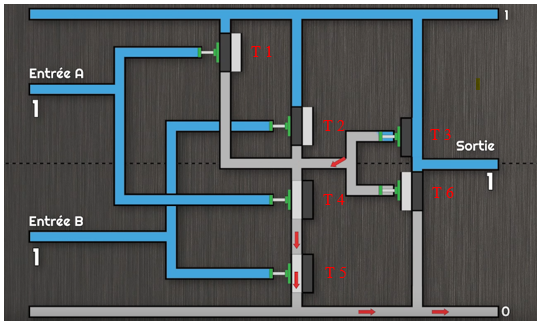
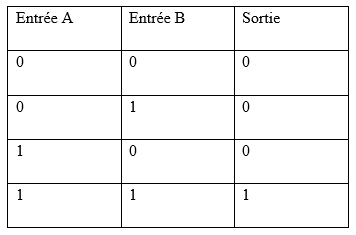

Fonctionnement d'un processeur
##############################

Les transistors
===============

Définition d'un transistor
__________________________

D'après :cite:p:`Definition:test-instances`, un transistor est un composant électronique constitué de matériaux semi-conducteurs utilisé pour redresser, amplifier ou interrompre des oscillations électriques en fonction de la tension qui lui est envoyée. 
Un transistor laisse passer le courant électrique dans un sens, mais pas dans l’autre.

Fonctionnement d'un transistor
______________________________

Un transistor fonctionne avec le binaire. 
Ainsi, une forte tension électrique est assimilée à la valeur 1, alors qu’une faible tension électrique à la valeur 0.

    Schéma de deux transistors, téléchargé depuis :cite:p:`Schéma_de_deux_transistors`

Voici un schéma qui présente les deux types de transistors qu’il est possible de construire. 
Le premier transistor est un transistor NPN.

Il est tout d’abord possible de distinguer la zone appelée substrat, qui est composée d’atomes de silicium dopé positivement, d’où la lettre P dans NPN. 
Cela signifie que le silicium a été bombardé d’ions afin de remplacer certains de ses atomes en une autre espèce d’atomes. 
Dans le cas d’un dopage positif, certains atomes de silicium sont remplacés par des atomes de bore qui contiennent un électron de moins que les atomes de silicium. 
Ainsi, le substrat dopé contient moins d’électrons que de protons et cherche constamment à obtenir des électrons, c’est la raison pour laquelle on parle de dopage positif.

Il peut être ensuite observé la source et le drain qui sont deux substrats de silicium dopés négativement. 
Certains des atomes de silicium ont été remplacés par des atomes de phosphore qui contiennent un électron de plus que les atomes de silicium. 
Cette fois-ci, le silicium dopé contient plus d’électrons que de protons et cherche constamment à se débarrasser d’électrons, c’est la raison pour laquelle on parle de dopage négatif. 
Le drain représente l’arrivée des électrons tandis que la source représente la sortie des électrons (pour autant que le courant circule). 
La source et le drain sont aussi appelés émetteur, respectivement collecteur.

Enfin, il est possible de distinguer la grille, également appelée base. 
La grille peut soit envoyer une tension positive, donc demander des électrons, soit envoyer une tension négative, c’est-à-dire apporter des électrons. 
La tension de la grille est toujours plus faible que la tension de la source.

Lorsqu’une zone dopée positivement est mise en contact avec une zone dopée négativement, si le courant électrique est faible, ce dernier ne peut circuler que de la zone négative à la zone positive, et non de la zone positive à la zone négative. 
Le courant électrique pourra néanmoins circuler de la zone positive à la zone négative si celui-ci est assez élevé.

Dans le cas du transistor NPN, si la grille envoie une tension négative, soit le signal 0, elle empêchera le courant électrique de passer du drain à la source. 
À l’inverse, si la grille envoie une tension positive, soit le signal 1, elle permettra au courant électrique de circuler du drain à la source. 
Le courant peut donc circuler dans un sens, mais pas dans l’autre. C’est ainsi que fonctionne le transistor NPN.

En ce qui concerne le transistor PNP, le substrat de silicium est cette fois-ci dopé négativement alors que la source et le drain sont dopés positivement. 
Cela a pour seule conséquence que lorsque la grille envoie une tension négative (signal 0), le courant électrique peut circuler de la source au drain, alors que si la grille envoie une tension positive (signal 1), le courant électrique ne peut pas circuler de la source au drain, d'après :cite:p:`transistors:test-instances`.

Les portes logiques
===================

Définition d'une porte logique
______________________________

Selon :cite:p:`Porte:test-instances`, une porte logique est un composant élémentaire d’un circuit numérique. 
Il existe sept portes logiques de base : AND, OR, XOR, NOT, NAND, NOR et XNOR. 
La majorité des portes logiques dispose de deux entrées et d’une sortie. 
L’objectif d’une porte logique est de renvoyer un signal positif (1) ou négatif (0) à la sortie en fonction des deux valeurs d’entrée.

Fonctionnement des portes logiques
__________________________________

    Schéma de la porte logique NOT, téléchargé depuis :cite:p:`Schéma_de_la_porte_logique_NOT`

La porte logique la plus simple est certainement la porte NOT, aussi appelé NON.
La figure 2 Schématise une porte logique NOT. 
Le but de cette porte est d’inverser la valeur d’entrée. 
Il est possible d’observer la tension d’alimentation qui envoie en continu un courant. 
La masse quant à elle attire les électrons lorsqu’il y a un courant. 
Les deux tiges noires juxtaposées d’un point blanc symbolisent un transistor PNP alors que les deux tiges noires situées vers le bas symbolisent un transistor NPN. 
Lorsque la valeur d’entrée est 1, le transistor PNP ne laisse pas passer le courant de l’alimentation à la sortie, alors que le transistor NPN laisse passer le signal issu de la masse qui est nul. 
C’est donc la valeur 0 qui sortira de la porte logique. 
À l’inverse, lorsque le signal d’entrée est 0, le transistor PNP laisse passer le courant de l’alimentation à la sortie, tandis que le transistor NPN ne laisse pas passer le signal nul issu de la masse. 
C’est donc cette fois-ci la valeur 1 qui sortira de la porte logique, d'après :cite:p:`transistors:test-instances-2`.

Il est dès lors possible de dresser un tableau récapitulatif qui présente les valeurs de sortie en fonction des valeurs d’entrée de la porte logique NOT :

    Tableau récapitulatif de la porte logique NOT, prise depuis :cite:p:`Tableau_recapitulatif_porte_NOT`

Ensuite, la porte logique AND a pour mission de retourner la valeur 1 uniquement lorsque les deux valeurs d’entrée valent 1. 
Voici une analogie qui utilise des systèmes hydrauliques pour illustrer le fonctionnement de la porte logique AND.

    Analogie de la porte logique AND utilisant des systèmes hydrauliques, prise depuis la vidéo :cite:p:`Analogie_porte_logique_AND`, à 3:24

Sur la figure 3, T1, T2 et T3 représentent des transistors PNP alors que T4, T5 et T6 représentent des transistors NPN. 
Le chiffre 1 présent tout en haut à droite symbolise l’arrivée du courant issu de l’alimentation. 
Lorsque les deux valeurs d’entrée valent 1, T1 et T2 ne laissent pas passer le courant, ce qui a pour conséquence de laisser ouvert T3 qui laisse alors passer le courant de l’alimentation à la sortie. 
La valeur de sortie est donc 1. 
Lorsque la valeur de l’entrée A est 1 et la valeur de l’entrée B est 0, T2 laisse passer le courant, ce qui a pour conséquence de fermer T3, ce qui empêche le courant de circuler de l’alimentation à la sortie. 
La valeur de sortie est donc 0. 
Lorsque la valeur de l’entrée A est 0 et la valeur de l’entrée B est 1, T1 laisse passer le courant, T3 est donc à nouveau fermé, ce qui empêche le courant de circuler de l’alimentation à la sortie. 
La valeur de sortie est donc 0. 
Enfin, dans le cas où la valeur de l’entrée A et B est 0, T1 et T2 sont ouverts, ce qui a pour conséquence de fermer T3, et d’empêcher le courant de circuler de l’alimentation à la sortie. 
La valeur de sortie est donc 0. Dans les trois derniers cas, T6 laissent passer le signal qui est nul, selon :cite:p:`transistors:test-instances-2`.
Il est dès lors possible de dresser un tableau récapitulatif de la porte logique AND, qui présente les valeurs de sortie en fonction des deux valeurs d’entrée :

    Tableau récapitulatif de la porte logique AND, prise depuis :cite:p:`Tableau_recapitulatif_porte_AND`

Pour la porte logique NAND, les valeurs de sortie sont simplement l’inverse des valeurs de sortie de la porte logique AND.
Concernant la porte logique OR, la valeur de sorti doit être 0 uniquement lorsque les deux valeurs d’entrée valent 0. 
Dans les trois autres cas, la valeur de sortie doit être 1.
Dans le cas de la porte logique NOR, les valeurs de sortie sont simplement l’inverse des valeurs de sortie de la porte logique OR.
Ensuite, la porte XOR retourne 0 si la valeur d’entrée A et la valeur d’entrée B sont identiques et 1 dans les deux autres cas.
À nouveau, pour la porte logique XNOR, les valeurs de sortie sont l’inverse des valeurs de sortie de la porte logique XOR, d'après :cite:p:`transistors:test-instances-2`.
Les différentes portes logiques ont dès lors été parcourues. 
Les portes logiques permettent de construire des circuits logiques plus ou moins complexes.

Presentation de l'additionneur à 4 bits
=======================================

Schéma interactif
_________________

..  raw:: html

    <iframe style="width: 200%; height: 795px; border: 0" src="https://logic.modulo-info.ch/?mode=design&data=N4IgbiBcCsA0IEsB2UDaoAOB7AzmgnAAyGwBMhAuvFgE4ICmSALlCHvAgCZQngCGAGygBGAL6xMuNAA5oJAGzQqibpGHwwgkeMl5IqeQGYS5ZbQbNW7FVFKGNWtTpDY9qaNJIB2Sh1WkAFgchJwkXKX1DTzJfEHNGFkg2ED8oQy9nVzRDY1gfZS406WDtMKz9YVzTajoEqxSbSEVMiNRo-NSm+VEzAFdE9HC3I28vJRqLROTO4W6y1qjR8bjayyTrQshjFrdKpbNVqY3VeUJnJgBPDHpWTgQcDAE+C4by1GE92E8C1RAvaQAtNJhCBzlcbkk7g8ni94G8PrlhN9On9CACvIZQWFLtdbvdHs9Xq0ESZkY0QNJ5ED8FjdDIiHkxgdJvVOtAevAAOZ8Jj0NygHEQkAADQA8gAlIluaQMxTLeJraaIFD6UiwQx9RIBMG4pIAQQAcgARKVoLwBOABU7MurrBrINAfWDCUiakSGHVCsWSuGtEawOU2xUbFXvLzO6RutT4T2sb2m-TycjqgKxBVHe2h5OkYRR0ikWP640J1ABfCW60TW1Kh36YrCAJR4Ts7Hg1gSksBWSwaCVlYsu0cLPh0iR6j9Wwx1u6kUd31uRYB6Dyw6s5XZdSGV3jxI5Quzn1DbI+FNp1eD9eRIKGeUTrZzAVtosm+doAIWshk9Nr2uoQz4WBUyjAIxGnIVDRfI9VWIT8zwHGtQytQCvGA6R9znKDUDsOBezg6sQzfAC5CjaBQMfGcIJLQIKzw4NMzQZce3kEiMjAuMMPhXJAyrOihwYoIPBIqdyK9DjiWTQwgJ4jM+MTcN5DHOI73kGNlBhLA70GQVWAwPgcGsN5pGif9aJky95B3KBWJEnS9IM1oiBIEDTJ-FUAKUxJhDONikl0-SSyTEgTKDMza1IOAPNsB8QG03y7ICryYhXeCCMgAI1UitKPR8lx4tfRMqmMELXKgd9LLSlsbLi-z8r-E9gukkqYAyjTEmgbKqtymrMMXOwXIvWt5HUTKk33Pz7IXU4kuKgaVSMcr5G1HLxpLIySAbfqEKsoJMrGMa8swob1uIxrZqsizdusmKny6ibsim2ZNtS6QWrvaQOuumcVtqj51o6ft8PoyBpB21qoFkDkQCeAAjegBH5TCSWdIr4F5AAPKYAGpaURz4+uUdGpgAXhx+EpsMRQCfoDH2PFAACEEdjfRKKeWQnabp0hSb9cnKdR6mpm9OnMSZipu0UWJ2aSIWAm5twAhvJdJYFjnoDltAFLgCWqZp6WJTp+R1f0fAP21-ndYPOmvCNrDu1wnWpn1xn5jcdqcL7KWQH1rnRawxjR2Vi2IIZm25FJQOpmDn2XeyGCrQj1hg5FmP9GXJyPZVpI6eD2Xfc8dOE+fOm1d9l0YLJT2DSwABbaGaHobObbL9aK8zkAq9r+u6YAISb4Ry1gh3WHFABLnBegEJgeRt2Q4GqGK271Z26VT7t589vVo5Xv9FfXxfk+3hk96D3OU7aRK+YXi3u+XzDoFTPJC5Abut8w0c4H+z3u4PzCH8-tvu6n0PuFRkbM27ilvm8eQihQFDySOKV+bwQIfyZObKY4of5kxQWAi24pc7KAAO4IHrm4d4eRGywFQCQfAVBUDhg1JQxK253jrXUKAMACA+BoDoYxdKvACEgAoBQDkdDnRqnYZw7hGJLQwRAAIoRIj+7OmYow+wwhwwSK4foOhptmzwDwLQxaCg9FyMEcI2h+YyDjCwkELwKisL2HfLQyoXwwgcK0agAwD8w7wHkZQoxgFkymIURYiySJQnOiCJo7hXYZH8LMYoueKFKGkAAoYNh4BJHaNiQGExfi-yyjyQk2hFMezMKiF8cp8lcyUJyOqXwpZ7A5loR+aojTAIkGidk3eRSQmUI-P+Fp6hRxuKyZ498OEgkGPMZQ6A4YywWKInALpniTIBlkfktZfDfHFNmfYLctD2pMVGR4hxcSdl9PcABSs7h1D3xOdw7CuSIr5I2s8i5MzSzFDkA87R5ASDQCmbsgwapJKGOvNYxayFfmeP7iYXpnykyAXsdAr4FCDBa2SQYIiY4qF5FxXYPIAEVkGBPCdUl61iC0PLHALyDSaWP0uekL4nTMmnPSjhBpHLnReWpWMHl9L+VEEuTA4EMKwycucfysuzjiDrTaXS1hlBPn8vsfyjodD5nMK8OGLwGT3HcMVcohpRr1HKpEe9AMDC2j2C8OItl3D8DSo1U62lwrPni1xd2DE4qGVInpf7XlnygiUnFXSrWA8QAoFlYQOePyo3AqUdIDRDrtHAgUJG6NlD02PwilmlhyYfB5sEYwwg2YTwJqZfYIy4r74RusXWvIzZZWKz1dYryu8GSVs+dAACMpxWpPrYsj+4VZU-Lte22NQVErdpEQJBRQA"></iframe>
Schéma interactif d'un additionneur à 4 bits, créé sur :cite:p:`logic.modulo-info.ch` à l'aide d'un schéma présent dans la vidéo :cite:p:`transistors:test-instances-2`, à 7:09.

..  only:: latex

    ..  figure:: images/schema_additionneur.png
        :align: center
        :width: 80%

        Schéma d'un additionneur à 4 bits

Explication du schéma
______________________

.. only:: html

    Afin d'être en mesure de voir en même temps le schéma et les explications, il est conseillé d'afficher ces derniers dans deux fenêtres différentes, l'une à côté de l'autre.

Le schéma présente le fonctionnement d'un additionneur à 4 bits.
Ce dernier est constitué d'une première entré A à 4 bits (A4-A3-A2-A1) et d'une deuxième entrée B à 4 bits (B4-B3-B2-B1) qui représentent le nombre A, respectivement le nombre B, que nous souhaitons additionner. 
Il y a ensuite un circuit complexe composé de 3 types de portes logiques: AND, XOR et OR, qui permet d'effectuer le calcul.
Puis, le résultat du calcul est affiché à l'aide de 4 bits (R4-R3-R2-R1). 
Enfin, 3 afficheurs ont été ajoutés sur la droite du schéma dans le but de facilité l'interprétation des entrées et du résultat, en affichant les nombres en base 10.

Un additionneur à 4 bits peut additionner des nombres dont le résultat ne dépasse pas 1111 en binaire, ce qui correspond à 15 en base 10.
Dans notre cas, il s'agit d'additionner les nombres 3 et 7, soit 0011 et 0111 en binaire.

Premièrement, A1 et A2 sont additionnés par XOR 7, ce qui donne 0.
Par conséquent, il faut garder la retenue de l'opération à l'aide de AND 5. 
Ainsi, R1 vaut 0.

Deuxièmement, A2 et B2 sont additionnés par XOR 3, ce qui donne à nouveau 0.
Il faut donc garder la retenue de l'opération à l'aide de AND 2.
Le résultat de XOR 3 et la retenue de AND 5 sont additionnés par XOR 6, ce qui donne 1.
par conséquent, il n'y a pas de retenue à garder dans AND 4.
Ainsi, R2 vaut 1.

Troisièmement, A3 et B3 sont additionnés par XOR 2, ce qui donne 1. 
Il n'y a donc pas de retenue à garder dans AND 1.
Le résultat de XOR 2 et la retenue de AND 2, qui transite par OR 2, sont additionnés par XOR 5, ce qui donne 0.
Par conséquent, il est nécessaire de garder la retenue de l'opération à l'aide de AND 3.
Ainsi, R3 vaut 0.

Quatrièmement, A4 et B4 sont additionnés par XOR 1, ce qui donne 0.
Le résultat de XOR 1 et la retenue de AND 3, qui transite par OR 1, sont additionnés par XOR 4, ce qui donne 1.
Ainsi, R4 vaut 1.

Enfin, en convertissant le nombre binaire 1010 en base 10, nous obtenons 10, ce qui est bien le résultat de l'addition de 3 et 7.

.. only:: html

    Afin de mieux comprendre comment fonctionne l'additionneur, il est possible de modifier la valeur des deux entrées, en changant la valeur de leurs bits (cliquer sur les bits pour changer la valeur).

